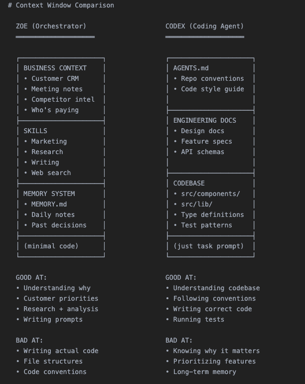

# 🛠️ Multi-Agent OpenClaw Deployment Guide

This guide is now strictly multi-agent. For a full step-by-step checklist
with copy-paste commands, use `MULTI_AGENT_SETUP.md` and then return here for
ops patterns and validation.

---

## 🎯 Outcome

By the end, you will have:

- Multiple isolated agents (separate workspace + sessions + identity).
- Deterministic channel routing via `bindings`.
- Optional sub-agent parallelization for burst workloads.
- A practical ops loop for health checks and CI-style quality gates.

---

## ✅ Step 1: Base Requirements

On the machine running OpenClaw:

```bash
npm install -g openclaw@latest
openclaw onboard --install-daemon
openclaw gateway status
```

Recommended platform notes from docs:

- Node 22+ runtime.
- Bun is not recommended for Gateway runtime.
- Windows users are best on WSL2 for host setup.

---

## 🧱 Step 2: Create Isolated Agents

Create one agent per domain persona.

```bash
openclaw agents add strategy --workspace ~/.openclaw/workspace-strategy
openclaw agents add coding --workspace ~/.openclaw/workspace-coding
openclaw agents add support --workspace ~/.openclaw/workspace-support
```

Inspect:

```bash
openclaw agents list --bindings
```

Each agent gets its own workspace and session store, so context does not bleed between roles unless you explicitly share it.

---

## 🔌 Step 3: Connect Channel Accounts and Bindings

### A) Log in channel accounts

Examples:

```bash
openclaw channels login --channel whatsapp --account personal
openclaw channels login --channel whatsapp --account biz
```

(For Telegram/Discord/Slack, set tokens in channel config as documented on each channel page.)

### B) Bind inbound traffic to agent IDs

```bash
openclaw agents bind --agent strategy --bind telegram:founder
openclaw agents bind --agent coding --bind discord:engineering
openclaw agents bind --agent support --bind whatsapp:biz
```

Check routing table:

```bash
openclaw agents bindings --json
```

Routing note:

- `--bind channel` maps default account only.
- `--bind channel:accountId` maps a specific account.

---

## 🧭 Step 4: Add Deterministic Multi-Agent Routing

Edit `~/.openclaw/openclaw.json` with explicit routing + session isolation.

```json
{
  "session": {
    "dmScope": "per-account-channel-peer"
  },
  "bindings": [
    {
      "agentId": "strategy",
      "match": {
        "channel": "telegram",
        "accountId": "founder"
      }
    },
    {
      "agentId": "coding",
      "match": {
        "channel": "discord",
        "accountId": "engineering"
      }
    },
    {
      "agentId": "support",
      "match": {
        "channel": "whatsapp",
        "accountId": "biz"
      }
    },
    {
      "agentId": "strategy",
      "match": {
        "channel": "whatsapp",
        "peer": {
          "kind": "direct",
          "id": "+15551234567"
        }
      }
    }
  ]
}
```

Apply with hot reload (or restart when needed):

```bash
openclaw gateway restart
openclaw agents list --bindings
openclaw channels status --probe
```

<p align="center">
  
</p>

---

## ⚡ Step 5: Parallelize with Sub-Agents

For burst tasks, use sub-agents from the orchestrator agent.

### Slash command flow

```text
/subagents spawn coding Implement API auth middleware --model openai/gpt-5.1-codex --thinking high
/subagents list
/subagents log #1 200 tools
/subagents kill all
```

### Recommended sub-agent defaults

```json
{
  "agents": {
    "defaults": {
      "subagents": {
        "maxSpawnDepth": 2,
        "maxChildrenPerAgent": 5,
        "runTimeoutSeconds": 900,
        "archiveAfterMinutes": 60
      }
    }
  }
}
```

This enables a practical orchestrator pattern: main agent -> orchestrator sub-agent -> worker sub-agents.

---

## 🔗 Step 5.1: GitHub Multi-Agent Patterns

These are real-world multi-agent setups documented by the community:

- Slack multi-bot, one agent per Slack app/bot (true per-agent identity).
- Telegram second agent with separate `accountId` and routing bindings.

Use these as templates to validate your config and routing logic.

---

## 🧪 Step 6: Production Validation and Ops

Run these checks regularly:

```bash
openclaw gateway status
openclaw channels status --probe
openclaw health --deep
```

Minimal delivery test per agent:

```bash
openclaw agent --agent strategy --message "status check"
openclaw agent --agent coding --message "status check"
openclaw agent --agent support --message "status check"
```

Operational pattern that works well:

1. Orchestrator receives request and scopes work.
2. Coding/support sub-agents execute in parallel.
3. CI + review gates run (`lint`, `typecheck`, tests, AI review).
4. Notify human in Telegram/Slack only after all gates pass.

<p align="center">
  
</p>

---

## 🧠 Step 7: Recommended Team Patterns

### 🏦 FTS: Fintech Startup Pack (Recommended)

This is the default pack shipped with the `setup_claw_empire` installer script. A compact 9-agent autonomous team covering all lifecycle stages:

| Dept | Agents |
|---|---|
| Planning & Architecture | Orchestrator (TL, Claude), Security Architect (Sr, Gemini) |
| Core Engineering | Sub1 Frontend (Sr, Codex), Sub2 Backend (Jr, Claude), Sub3 DevOps (Jr, Gemini), Data Engineer (Sr, Codex) |
| Quality & Compliance | Reviewer (TL, Codex), Test Automation (Sr, Claude), Compliance Auditor (Jr, Gemini) |

See [`CLAW_EMPIRE_SETUP.md`](CLAW_EMPIRE_SETUP.md) for the visual office setup and CEO directive workflows.

### 👤 Solo Founder Pattern

For a minimal founder team:

- **Strategy agent:** planning, prioritization, daily recap.
- **Coding agent:** implementation and bugfix.
- **Marketing/research agent:** trends, content, competitor scan.
- **Support agent:** customer and operations workflows.

Start with different model defaults per role, then tune by cost/latency.

---

## 🔗 GitHub Guides Used

- Official multi-agent concept doc: [docs.openclaw.ai/concepts/multi-agent](https://docs.openclaw.ai/concepts/multi-agent)
- Official sub-agents doc: [docs.openclaw.ai/tools/subagents](https://docs.openclaw.ai/tools/subagents)
- Official agents CLI doc: [docs.openclaw.ai/cli/agents](https://docs.openclaw.ai/cli/agents)
- Community multi-agent team guide: [awesome-openclaw-usecases/multi-agent-team](https://github.com/hesamsheikh/awesome-openclaw-usecases/blob/main/usecases/multi-agent-team.md)
- Community content-factory guide: [awesome-openclaw-usecases/content-factory](https://github.com/hesamsheikh/awesome-openclaw-usecases/blob/main/usecases/content-factory.md)

---

## 🔀 Next Steps

Your multi-agent platform is built!
- Check out [`USECASES.md`](USECASES.md) for concrete examples of how your agents can run your business logic.

---

Ready for practical workflows? Continue with [USECASES.md](USECASES.md).
