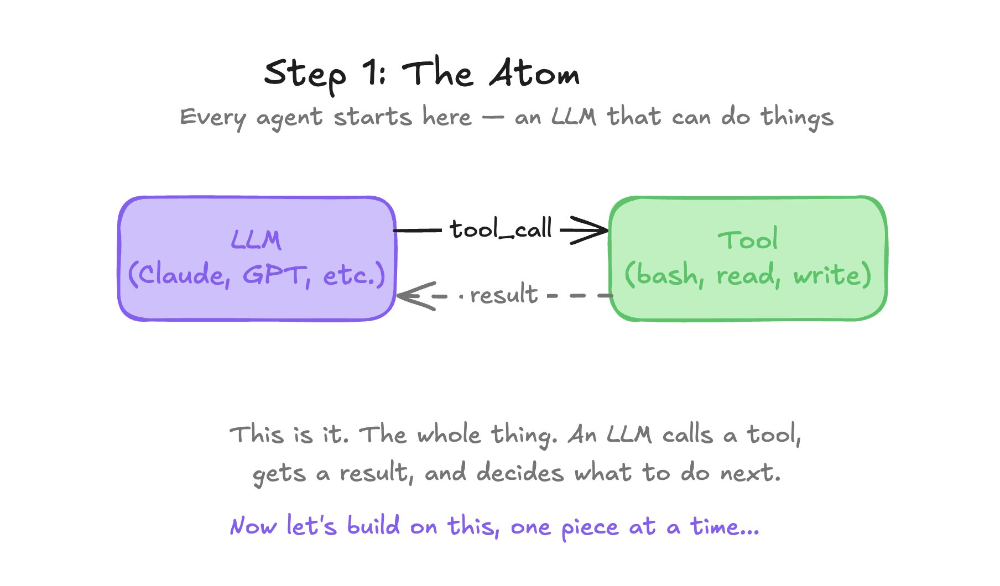
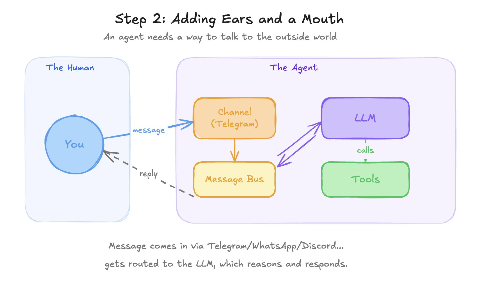
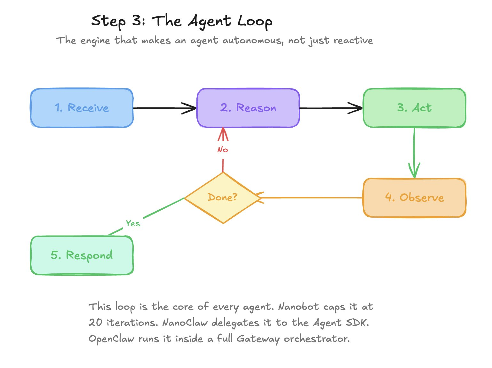
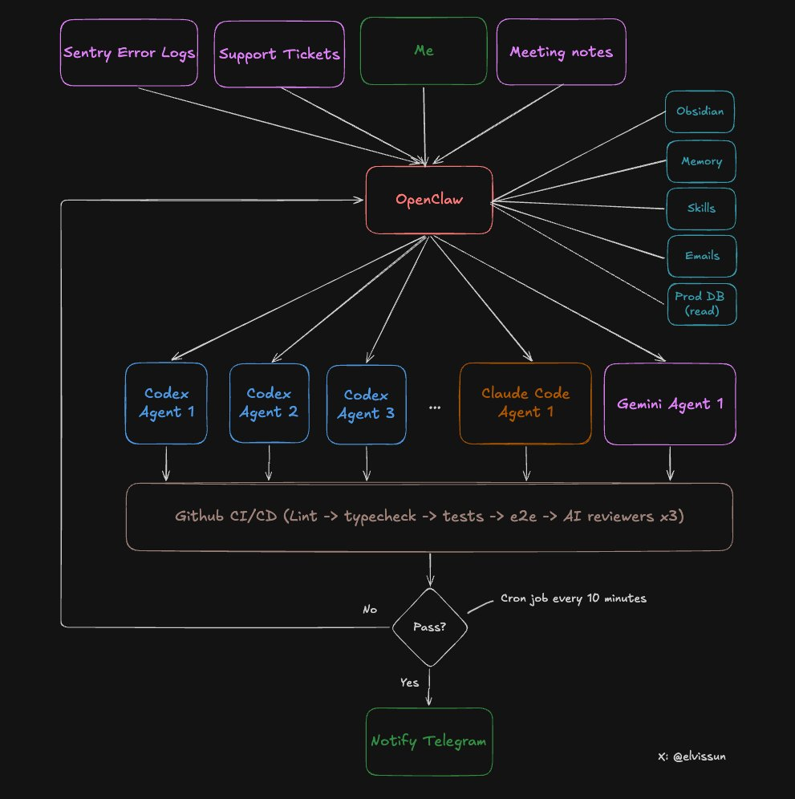

<div align="center">

# 🤖 AgentsSwarm (Powered by OpenClaw)

[](https://opensource.org/licenses/MIT)
[](http://makeapullrequest.com)
[](https://github.com/SamurAIGPT/awesome-openclaw)

**A next-generation, zero-code, hyper-scalable autonomous AI agent swarm orchestration ecosystem.**
<br/>
Leverage multi-modal LLM reasoning like Claude, GPT Codex, or Local Ollama, deterministic CI/CD pipelines, and asynchronous RAG memory layers to deploy an entire decentralized AI software agency—managed natively through enterprise chat platforms (Discord, Slack, Telegram, WhatsApp). <b>100% No-Code Friendly.</b>

</div>

---

## 📖 Table of Contents
- [Features](#-features)
- [Quick Start & Installation](#-quick-start--installation)
- [OpenClaw Detailed Setup Guide (New!)](OPENCLAW_SETUP.md)
- [Detailed Deployment Guide (New!)](DEPLOYMENT_GUIDE.md)
- [Architecture: How It Works](#-architecture-how-it-works)
    - [The Agent Progression](#the-agent-progression)
- [Advanced CI/CD Swarm Layer (Highlight)](#-advanced-cicd-swarm-layer-highlight)
- [The Claw Ecosystem](#-the-claw-ecosystem)
- [Codex Comparison](#-codex-comparison)
- [Discover Use Cases (New!)](USECASES.md)
- [Credits & Acknowledgements](#-credits--acknowledgements)

---

## ✨ Features
- **Multi-Platform Native:** Control your swarm from Discord, WhatsApp, Telegram, or Slack seamlessly.
- **Micro to Monolith:** Scale from a single 5MB background process to a massive enterprise CI/CD powerhouse.
- **Pluggable Architecture:** Effortlessly attach memory layers (SQLite, Postgres, Markdown) and external skills.
- **Automated QA Loops:** Built-in reviewer agents that lint, typecheck, and validate code autonomously.

---

## 🚀 Quick Start & Installation

Getting your first Swarm online requires absolutely no coding experience. Follow these steps.

### Prerequisites
1. **Node.js** (v18 or higher) installed on your system.
2. A **Discord Base** (or Telegram/WhatsApp) with admin privileges to add bots.

### Installation
Clone this repository and install the initial dependencies:
```bash
git clone https://github.com/your-username/AgentsSwarm.git
cd AgentsSwarm
npm install
```

### Configuration
Create a `.env` file in the root directory and add your Bot Tokens and API Keys:
```env
DISCORD_TOKEN_ORCHESTRATOR=your_token_here
DISCORD_TOKEN_SUBAGENT_1=your_token_here
OPENAI_API_KEY=your_key_here
```
Run the initialization script:
```bash
npm run swarm:start
```

> **🔥 Detailed Configuration & Launch**  
> 1. To configure different AI Models (OpenAI, Ollama) and connect to Slack/Telegram, read the **[OpenClaw Setup Guide](OPENCLAW_SETUP.md)**.
> 2. For instructions on running multiple agents simultaneously (Orchestrator + CI/CD Reviewers) via PM2 or multiple terminals, read the **[Step-by-Step Deployment Guide](DEPLOYMENT_GUIDE.md)**!

---

## 🧠 Architecture: How It Works

Understanding your new Swarm begins with understanding the core anatomy of an individual Agent.

### The Agent Progression

**1. The Atom**  
Every autonomous swarm begins here—an LLM capable of making decisions and executing actions through specific tools. It is the basic bridge between thought and capability.
<p align="center">
  
</p>

**2. Adding the Interface**  
An agent needs to communicate where humans naturally gather. By attaching a messaging layer, we bring the agent directly to platforms like Discord, Telegram, or WhatsApp.
<p align="center">
  
</p>

**3. The Agent Loop**  
The agent evaluates the given prompt, acts by calling a tool, observes the results, and loops this process repeatedly until it is satisfied the objective is fully achieved.
<p align="center">
  
</p>

**4. Memory & Skills**  
To be scalable, the agent needs persistent context. We provide it with a long-term Memory System and a Skill System (APIs, custom scripts, database access) to interact with complex external environments.
<p align="center">
  
</p>

---

## 👑 Advanced CI/CD Swarm Layer (Highlight)

When you are ready to move beyond simple chatbots, the system evolves into extreme automation. This is the **Swarm Architecture**—where OpenClaw becomes an autonomous enterprise factory that never sleeps.

<p align="center">
  
</p>

### The Workflow:
1. **Input Ingestion:** The Orchestrator safely ingests real-time inputs natively (Sentry error logs, Support Tickets, user prompts, Meeting Notes).
2. **Specialized Delegation:** The Orchestrator queries long-term Obsidian/DB memories, then creates and delegates tasks simultaneously to *Codex Agents*, *Claude Agents*, and *Gemini Agents*.
3. **The Review Pipeline:** Sub-agent output is never blindly merged. It is piped directly into a GitHub CI/CD pipeline enforcing: `Lint -> Typecheck -> Unit Tests -> E2E -> AI Code Reviewers`.
4. **Resolution:** If the pipeline fails, it loops back to the sub-agents. When it passes, the manager is pinged on Telegram with the finalized deployment.

---

## 🏗️ The Claw Ecosystem

Different tasks require different foundational constraints. The open-source ecosystem provides varied framework backends tailored to your deployment strategy.

<p align="center">
  
</p>

Depending on your need for speed, memory constraint, or language preference, you can dynamically swap the underlying agent architectures:

### 1. NanoClaw
- **Language:** TypeScript
- **Optimal For:** Ultra-lightweight deployment, single channel messaging (e.g., WhatsApp).
- **Core Specs:** ~500 lines of code, blazing fast startup, very low memory consumption.
NanoClaw is the entry point for minimalistic deployments. It prioritizes a tiny footprint, making it perfect for simple, standalone bots that don't need persistent memory routing or major framework dependencies.
<p align="center">
  <a href="https://github.com/qwibitai/nanoclaw"></a>
</p>

### 2. Nanobot
- **Language:** Python
- **Optimal For:** Learning, research environments, and quick prototyping.
- **Core Specs:** ~4,000 lines of code, ~0.8s startup, ~100MB memory, supports 9+ channels.
Built to harness the power of Python's massive AI ecosystem, Nanobot uses simple Markdown & graph structures for its memory system. It's an excellent stepping stone for data scientists moving into automated agent creation.
<p align="center">
  <a href="https://github.com/HKUDS/nanobot"></a>
</p>

### 3. PicoClaw
- **Language:** Go
- **Optimal For:** Edge devices and IoT workloads.
- **Core Specs:** ~41,000 lines of code, <1s startup, <10MB memory footprint, supports 6+ channels.
PicoClaw takes advantage of Go's exceptional compilation speed and concurrency. It is heavily utilized in edge-computing scenarios where resources are drastically limited but the agent still requires robust logic loops.
<p align="center">
  <a href="https://github.com/sipeed/picoclaw"></a>
</p>

### 4. IronClaw
- **Language:** Rust
- **Optimal For:** High security, zero-trust deployments.
- **Core Specs:** ~128,000 lines, <10ms startup, ~7.8MB memory, WASM + Docker security models.
IronClaw is built like a fortress. By executing all unverified operations within heavily isolated WebAssembly (WASM) boundaries, it protects the core system from malicious code—critical when letting an agent browse the web or run Python scrips.
<p align="center">
  <a href="https://github.com/nearai/ironclaw"></a>
  
</p>

### 5. ZeroClaw
- **Language:** Rust
- **Optimal For:** Maximum flexibility and enterprise backend routing.
- **Core Specs:** ~144,000 lines, <10ms startup, <5MB memory footprint.
ZeroClaw utilizes incredibly efficient SQLite hybrid memory and trait-based plugins. It is generally heavily customized and implemented in high-performance backend pipelines running autonomous financial or data operations.
<p align="center">
  <a href="https://github.com/zeroclaw-labs/zeroclaw"></a>
</p>

### 6. OpenClaw (The Monolith)
- **Language:** TypeScript
- **Optimal For:** Absolutely everything. Orchestrating other agents.
- **Core Specs:** ~400,000+ lines, full App + Docker abstraction, SQL + Markdown hybrid memory, accesses over 5,700 skills.
OpenClaw is the orchestrator. While it uses more memory (~1.5GB) and has a longer startup time, it serves as the ultimate brain. It connects to 11+ channels, maintains huge database contexts, and most importantly, can summon other agents as sub-tools.
<p align="center">
  <a href="https://github.com/openclaw/openclaw"></a>
</p>

> **Note on Architectures & Scaling:** If you plan on deploying multiple agents simultaneously across different chat platforms as described above, please refer to the detailed **[DEPLOYMENT_GUIDE.md](DEPLOYMENT_GUIDE.md)** for execution parameters.

### Comprehensive Comparison Matrix
Need deep metrics to choose your base? View the data below:
<p align="center">
  
</p>

---

## ⚔️ Codex Comparison

How does the OpenClaw orchestration method hold up against strict coding specialists like Codex? Extremely well, particularly in open-ended infrastructure workflows.
<p align="center">
  
</p>

---

## � Credits & Acknowledgements

The foundational architectures, framework progression methodologies, and visual models powering this repository were natively drawn from invaluable contributions by the community:

- **@MisbahSy** for the underlying operational layout and agent capability progressions.
- **@elvissun** for the brilliant "Agent System Swarm" CI/CD integration architecture.
- **@hesamsheikh** for pioneering seamless multi-platform workflow integrations.
- **@123olp** and **@JXiaoLoong** for extended insights into infrastructure bounds and routing logic.
