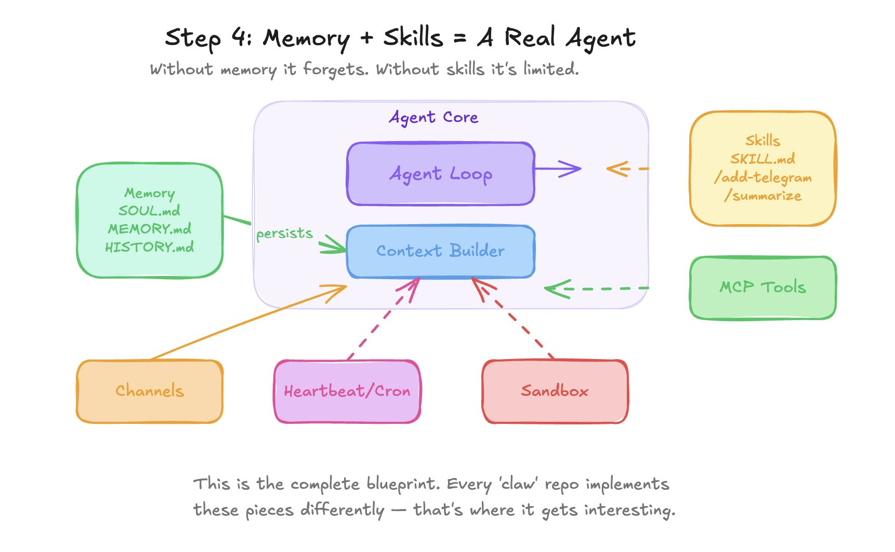
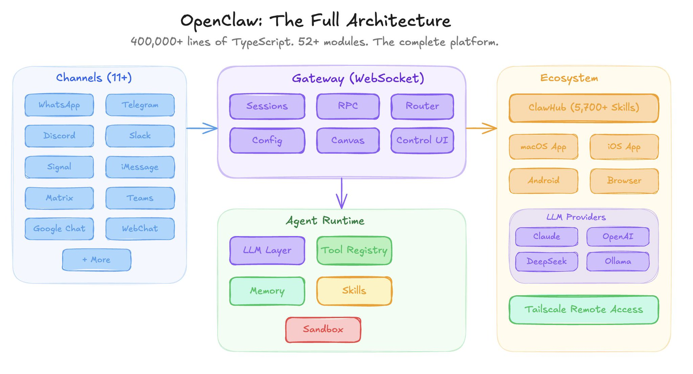
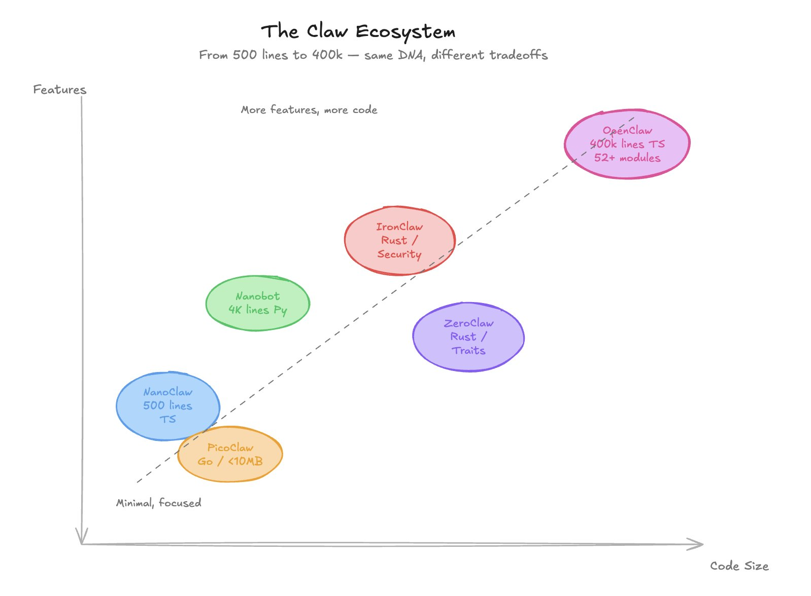
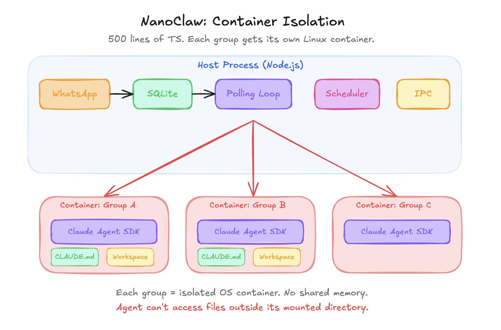
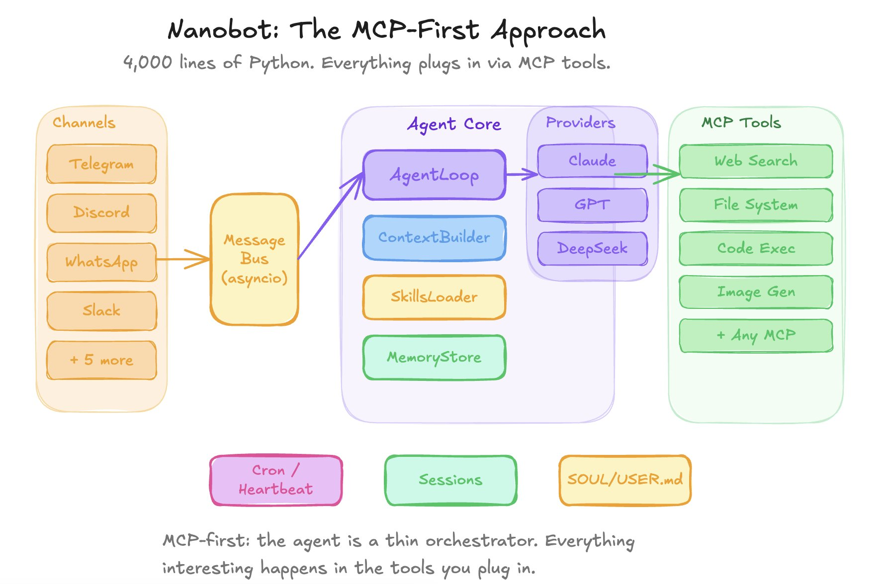
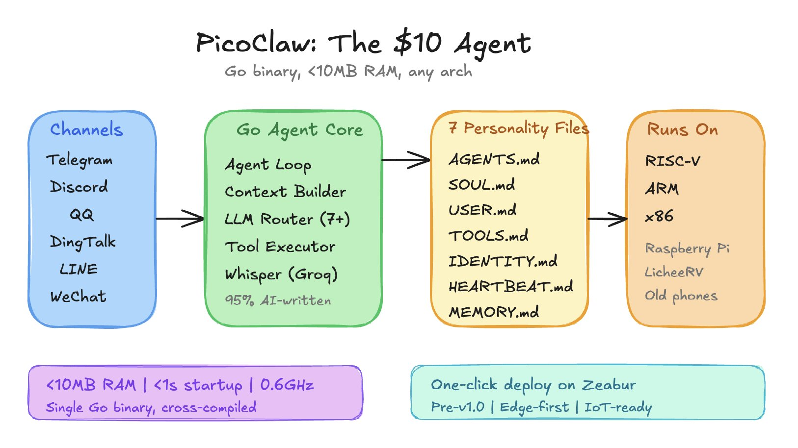
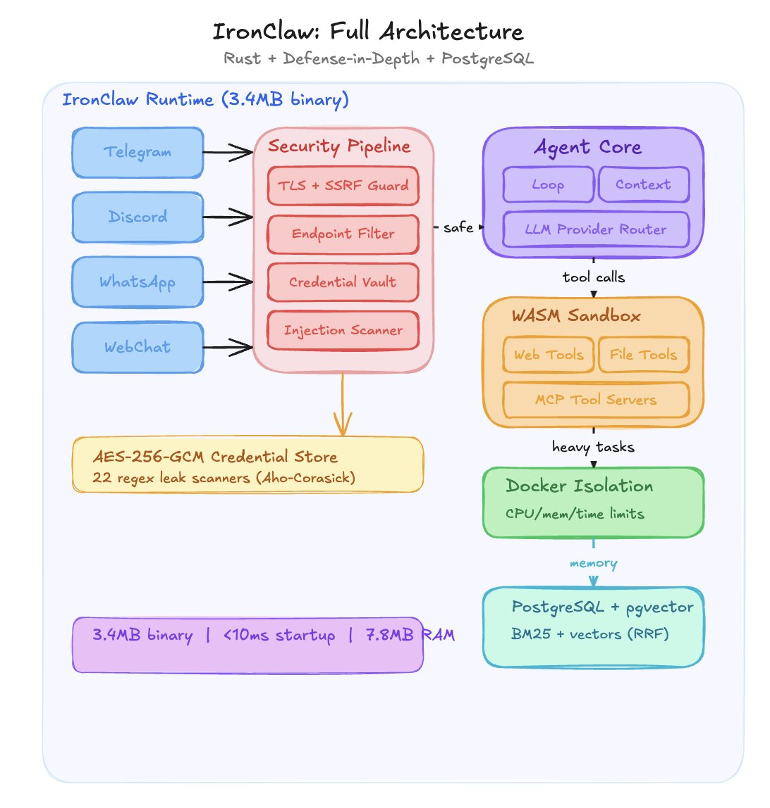
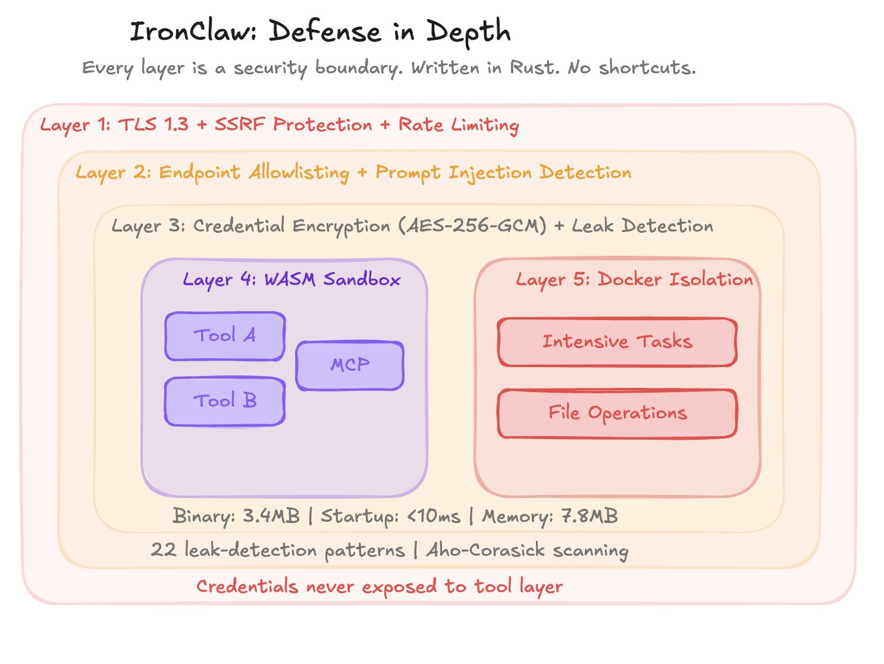
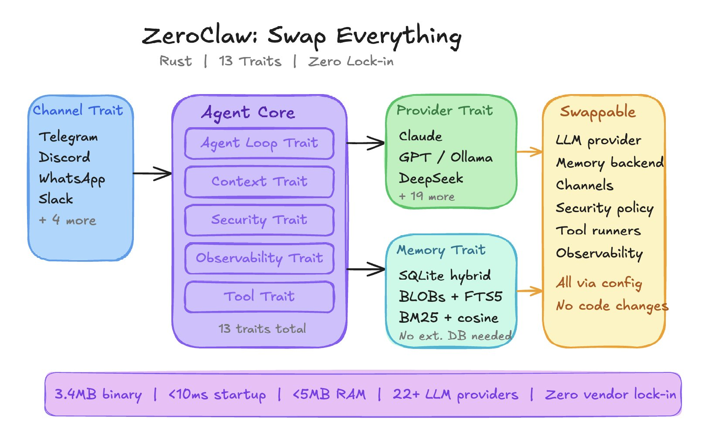
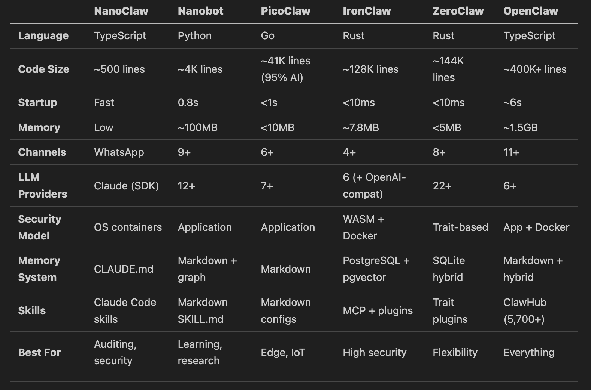

<div align="center">

# 🤖 AgentsSwarm: OpenClaw Multi-Agent Orchestration

[](https://opensource.org/licenses/MIT)
[](http://makeapullrequest.com)
[](https://github.com/SamurAIGPT/awesome-openclaw)

**The ultimate playbook for building an autonomous AI Agent Swarm. From single-agent chat setups to enterprise-grade Multi-Agent Orchestration and virtual Office Simulators (Fintech Teams, QA bots, and Automated Trading structures), powered entirely by OpenClaw.**

</div>

---

## 📖 Table of Contents

- [March 2026 Refresh](#-march-2026-refresh)
- [What This Repo Is](#-what-this-repo-is)
- [Quick Start (OpenClaw Host)](#-quick-start-openclaw-host)
- [Claw-Empire: AI Agent Office](#️-claw-empire-ai-agent-office)
- [Architecture: Agent Progression](#-architecture-agent-progression)
- [Models: Latest Provider Snapshot](#-models-latest-provider-snapshot)
- [Messaging Apps: Latest Channel Snapshot](#-messaging-apps-latest-channel-snapshot)
- [Multi-Agent Setup Guides](#multi-agent-setup-guides)
- [Use Cases](#-use-cases)
- [Brainstorm: How to Evolve This Repo](#-brainstorm-how-to-evolve-this-repo)
- [Sources](#-sources)
- [Credits](#-credits)

---

## 🆕 March 2026 Refresh

- **OpenClaw package/version:** `openclaw@2026.2.26` on npm.
- **Provider docs updated:** current provider hub is `docs.openclaw.ai/providers`.
- **Current model examples in docs:** `anthropic/claude-opus-4-6`, `openai/gpt-5.1-codex`, `openai-codex/gpt-5.3-codex`, `openrouter/anthropic/claude-sonnet-4-5`, `ollama/gpt-oss:20b`.
- **Messaging docs now list 20+ channels**, including WhatsApp, Telegram, Discord, Slack, Signal, Teams, Matrix, Zalo, and more.
- **Deployment guide rewritten for multi-agent** using current `openclaw agents`, bindings, and sub-agent patterns.
- **Use cases updated** with newer community patterns from `awesome-openclaw-usecases` (including multi-agent specialized team and custom morning brief).
- **Claw-Empire integration added**: 1-click setup via `setup_claw_empire.bat` now includes the **FTS: Fintech Startup** office pack (9-agent autonomous team) and applies custom source overrides automatically.
- **FTS Office Pack**: 3 departments, 9 agents (Orchestrator, Security Architect, Sub1-3, Data Engineer, Reviewer, Test Automation Engineer, Compliance Auditor) pre-registered in the `fts` workflow pack key.

---

## ✅ What This Repo Is

This repository is a comprehensive set of **docs, diagrams, and integration templates** representing modern OpenClaw ecosystem deployment patterns for **Autonomous AI Agents**:

- [`OPENCLAW_SETUP.md`](OPENCLAW_SETUP.md): current model and messaging setup (Discord, Telegram).
- [`MULTI_AGENT_SETUP.md`](MULTI_AGENT_SETUP.md): initial multi-agent workspace generation and routing.
- [`DEPLOYMENT_GUIDE.md`](DEPLOYMENT_GUIDE.md): advanced multi-agent operations and team topologies.
- [`CLAW_EMPIRE_SETUP.md`](CLAW_EMPIRE_SETUP.md): install and configure the Claw-Empire visual AI office simulator.
- [`USECASES.md`](USECASES.md): curated real-world use-case ideas (automated trading, research, content).
- [`templates/claw-empire-integration/`](templates/claw-empire-integration/): The **FTS Office Pack**, a complete 9-agent Fintech Startup source override with Windows/Linux automated registration scripts.

It acts as the neural bridge linking standard OpenClaw execution loops with the Claw-Empire interface, offering seamless 1-click deployments of complex agent swarms.

---

## 🚀 Quick Start (OpenClaw Host)

Use these commands on the machine where OpenClaw runs:

```bash
npm install -g openclaw@latest
openclaw onboard --install-daemon
openclaw dashboard
```

Then continue with:

1. [`OPENCLAW_SETUP.md`](OPENCLAW_SETUP.md) for models + channels.
2. [`DEPLOYMENT_GUIDE.md`](DEPLOYMENT_GUIDE.md) for multi-agent routing.
3. [`MULTI_AGENT_SETUP.md`](MULTI_AGENT_SETUP.md) for multi-agent setup.
4. [`CLAW_EMPIRE_SETUP.md`](CLAW_EMPIRE_SETUP.md) for the AI office simulator + FTS pack.
5. [`USECASES.md`](USECASES.md) to pick a workflow blueprint.

---

## 🏢 Claw-Empire: AI Agent Office Simulator

[Claw-Empire](https://github.com/GreenSheep01201/claw-empire) transforms your OpenClaw swarm into a visual, virtual software company. Run our 1-click setup to get started:

**Windows PowerShell:**
```powershell
.\setup_claw_empire.bat
```

**macOS / Linux:**
```bash
./setup_claw_empire.sh
```

This will automatically clone the repo, install Node/pnpm dependencies, apply the **FTS: Fintech Startup** custom source overrides, rebuild the app, and securely register all 9 agents into isolated databases. 

Then launch the simulator UI with:

**Windows:** `.\start_claw_empire.bat`
**macOS/Linux:** `./start_claw_empire.sh`

### FTS: Fintech Startup — Autonomous Office Pack

This pack ships a compact autonomous team across 3 departments:

| Dept | Key | Agents |
|---|---|---|
| Planning & Architecture | `planning` | Orchestrator (Claude, TL) + Security Architect (Gemini, Sr) |
| Core Engineering | `dev` | Sub1 Frontend (Codex, Sr), Sub2 Backend (Claude, Jr), Sub3 DevOps (Gemini, Jr), Data Engineer (Codex, Sr) |
| Quality & Compliance | `qa` | Reviewer (Codex, TL), Test Automation (Claude, Sr), Compliance Auditor (Gemini, Jr) |

See [`templates/claw-empire-integration/FTS_USE_CASE.md`](templates/claw-empire-integration/FTS_USE_CASE.md) for the full architecture description.

---

## 🧠 Architecture: Agent Progression

This flow tracks the progression highlighted in Misbah Syed's architecture thread.

**1. The Atom (LLM + tool calls)**

<p align="center">
  
</p>

**2. Messaging adapters (Telegram/Discord/WhatsApp/etc.)**

<p align="center">
  
</p>

**3. Agent loop (reason -> act -> observe -> repeat)**

<p align="center">
  
</p>

**4. Memory + skills layer**

<p align="center">
  
</p>

**5. Gateway-centered orchestration**

<p align="center">
  
</p>

**6. Real-world orchestrator outcomes (solo founder setup)**

<p align="center">
  
</p>

**7. Claw ecosystem landscape snapshot**

<p align="center">
  
</p>

---

## 🧩 Models: Latest Provider Snapshot

OpenClaw now documents providers under `docs.openclaw.ai/providers`.

### Common 2026 model refs

- `anthropic/claude-opus-4-6`
- `openai/gpt-5.1-codex`
- `openai-codex/gpt-5.3-codex` (Codex subscription auth path)
- `openrouter/anthropic/claude-sonnet-4-6`
- `ollama/gpt-oss:120b`

### Example default model config

```json
{
  "agents": {
    "defaults": {
      "model": {
        "primary": "anthropic/claude-opus-4-6",
        "fallbacks": [
          "openai/gpt-5.1-codex",
          "openrouter/anthropic/claude-sonnet-4-5"
        ]
      }
    }
  }
}
```

### Local model path (Ollama)

```bash
ollama pull gpt-oss:20b
```

```env
OLLAMA_API_KEY="ollama-local"
```

---

## 🏗️ The Claw Ecosystem (Comparison)

Different tasks require different foundational constraints. The open-source
ecosystem provides varied framework backends tailored to your deployment
strategy.

<p align="center">
  
</p>

Depending on your need for speed, memory constraint, or language preference,
you can dynamically swap the underlying agent architectures:

### 1. NanoClaw

- **Language:** TypeScript
- **Optimal For:** Ultra-lightweight deployment, single channel messaging.
- **Core Specs:** ~500 lines of code, very low memory consumption.
NanoClaw is the entry point for minimalistic deployments.
<p align="center">
  <a href="https://github.com/qwibitai/nanoclaw"></a>
</p>

### 2. Nanobot

- **Language:** Python
- **Optimal For:** Learning, research environments, and quick prototyping.
- **Core Specs:** ~4,000 lines of code, ~0.8s startup, ~100MB memory.
Nanobot is a lean, hackable orchestration layer.
<p align="center">
  <a href="https://github.com/HKUDS/nanobot"></a>
</p>

### 3. PicoClaw

- **Language:** Go
- **Optimal For:** Edge devices and IoT workloads.
- **Core Specs:** ~41,000 lines of code, <1s startup, <10MB memory footprint.
<p align="center">
  <a href="https://github.com/sipeed/picoclaw"></a>
</p>

### 4. IronClaw

- **Language:** Rust
- **Optimal For:** High security, zero-trust deployments.
- **Core Specs:** ~128,000 lines, <10ms startup, ~7.8MB memory, WASM + Docker.
<p align="center">
  <a href="https://github.com/nearai/ironclaw"></a>
  
</p>

### 5. ZeroClaw

- **Language:** Rust
- **Optimal For:** Maximum flexibility and enterprise backend routing.
- **Core Specs:** ~144,000 lines, <10ms startup, <5MB memory footprint.
<p align="center">
  <a href="https://github.com/zeroclaw-labs/zeroclaw"></a>
</p>

### 6. OpenClaw (The Monolith)

- **Language:** TypeScript
- **Optimal For:** Orchestrating other agents at scale.
- **Core Specs:** ~400,000+ lines, SQL + Markdown hybrid memory, 11+ channels.
<p align="center">
  <a href="https://github.com/openclaw/openclaw"></a>
</p>

### Comprehensive Comparison Matrix

<p align="center">
  
</p>

---

## 💬 Messaging Apps: Latest Channel Snapshot

From current OpenClaw channel docs, notable supported channels include:

- **Core popular channels:** WhatsApp, Telegram, Discord, Slack, Signal.
- **Also available:** IRC, Google Chat, Mattermost, Microsoft Teams, Feishu, LINE, Matrix, Nextcloud Talk, iMessage (legacy), BlueBubbles, Twitch, Zalo, Synology Chat, Nostr, Tlon.
- **Plugin-installed channels** are explicitly marked in docs (for example Teams/Mattermost/LINE/Matrix/Twitch/Zalo variants).

Operational note: fastest setup is usually Telegram; WhatsApp needs QR pairing and persistent session state.

---

## Multi-Agent Setup Guides

- **Initial setup + channels:** [OPENCLAW_SETUP.md](OPENCLAW_SETUP.md)
- **Main step-by-step:** [MULTI_AGENT_SETUP.md](MULTI_AGENT_SETUP.md)
- **Deployment guide:** [DEPLOYMENT_GUIDE.md](DEPLOYMENT_GUIDE.md)
- **Claw-Empire office sim:** [CLAW_EMPIRE_SETUP.md](CLAW_EMPIRE_SETUP.md)
- **FTS Pack details:** [templates/claw-empire-integration/FTS_USE_CASE.md](templates/claw-empire-integration/FTS_USE_CASE.md)
- **Explore Use Cases:** [USECASES.md](USECASES.md)
- **Team pattern reference:** [Multi-Agent Specialized Team](https://github.com/hesamsheikh/awesome-openclaw-usecases/blob/main/usecases/multi-agent-team.md)
- **Content pipeline reference:** [Multi-Agent Content Factory](https://github.com/hesamsheikh/awesome-openclaw-usecases/blob/main/usecases/content-factory.md)

---

## 💡 Use Cases

Explore updated patterns in [`USECASES.md`](USECASES.md), including:

- Multi-Agent Specialized Team (strategy + dev + marketing + business)
- Multi-Channel Personal Assistant
- Family Calendar & Household Assistant
- Custom Morning Brief
- Semantic Memory Search
- Event Guest Confirmation

---

## 🧪 Brainstorm: How to Evolve This Repo

1. **Add a copy-paste config cookbook**
   Create per-channel and per-agent `openclaw.json` templates (single-agent, founder-team, content-factory, support-desk).

2. **Add a security-hardening guide**
   Document minimal tool profiles, channel allowlists, and isolated sandbox recommendations before production deployment.

3. **Add an operations runbook**
   Cover `openclaw health`, `openclaw channels status --probe`, restart paths, and incident recovery checklists.

4. **Add a benchmark matrix**
   Track model quality/cost/latency by task class (coding, research, customer support).

5. **Add visual architecture pages**
   Turn the image set into dedicated explainers: base loop, multi-agent routing, and orchestrator + reviewer pipelines.

6. **Add a “recipes from the community” section**
   Continuously ingest standout workflows from curated GitHub lists and maintain date-stamped updates.

---

## 🔗 Sources

- OpenClaw official docs: [docs.openclaw.ai](https://docs.openclaw.ai/)
- Providers hub: [docs.openclaw.ai/providers](https://docs.openclaw.ai/providers)
- Channels hub: [docs.openclaw.ai/channels](https://docs.openclaw.ai/channels)
- Multi-agent concepts: [docs.openclaw.ai/concepts/multi-agent](https://docs.openclaw.ai/concepts/multi-agent)
- Sub-agents docs: [docs.openclaw.ai/tools/subagents](https://docs.openclaw.ai/tools/subagents)
- Awesome OpenClaw guide: [SamurAIGPT/awesome-openclaw](https://github.com/SamurAIGPT/awesome-openclaw)
- Awesome OpenClaw use cases: [hesamsheikh/awesome-openclaw-usecases](https://github.com/hesamsheikh/awesome-openclaw-usecases)
- Misbah Syed architecture thread: [x.com/MisbahSy/status/2025570052108665231](https://x.com/MisbahSy/status/2025570052108665231)
- Elvis Sun orchestrator article: [x.com/elvissun/article/2025920521871716562](https://x.com/elvissun/article/2025920521871716562)
- JXiaoLoong article: [x.com/JXiaoLoong/status/2024376180707905816](https://x.com/JXiaoLoong/status/2024376180707905816)
- 123olp workflow prompt post: [x.com/123olp/status/2025704271921213731](https://x.com/123olp/status/2025704271921213731)

---

## 🙌 Credits

- **@MisbahSy** for architecture progression visuals and framework tradeoff framing.
- **@elvissun** for practical orchestration + CI/CD execution patterns.
- **@hesamsheikh** for maintaining community use-case curation.
- **@SamurAIGPT** for curated ecosystem resources.
